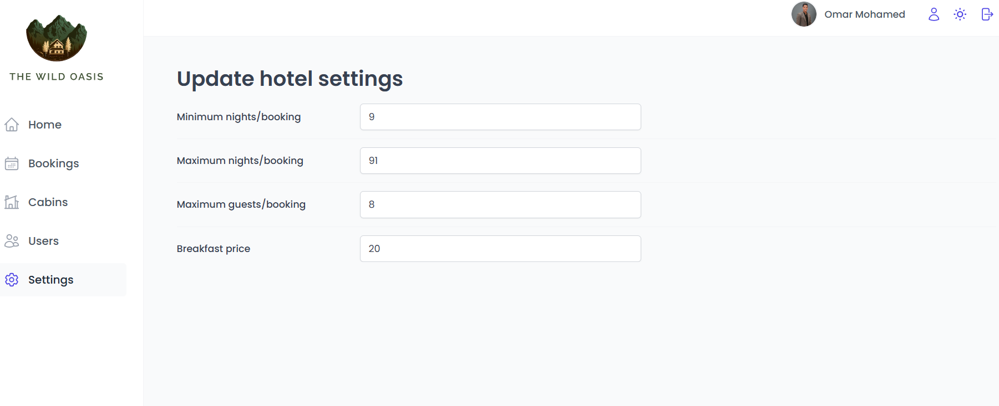

# The Wild Oasis

**The Wild Oasis** is a hotel booking application that allows admins to manage cabin bookings, additional options like breakfast, and the duration of stays. The app includes a dark mode, statistics, and user authentication for secure access.

## Table of Contents
- [Features](#features)
- [Technologies Used](#technologies-used)
- [Getting Started](#getting-started)
- [Usage](#usage)
- [Screenshots](#screenshots)
- [Contact](#contact)

## Features
- **Cabin Booking Management**: Admins can book cabins on behalf of users with or without breakfast.
- **Customizable Stays**: Admins can specify the number of days for the stay.
- **Checkout and Payment**: Admins can manage the billing and payment process upon checkout.
- **Dark Mode**: The application supports a dark mode for better user experience in low-light conditions.
- **Statistics**: Provides insights and statistics about bookings.
- **User Authentication**: Secure login and registration functionality for admins.
- **Admin Settings**: Admins can set breakfast and cabin prices.

## Technologies Used
- **Frontend**: ReactJS, React Router, Context API, Styled Components
- **State Management**: React Query
- **Backend**: Supabase (for authentication and database)
- **Styling**: Styled Components

## Getting Started
Follow these instructions to get a copy of the project up and running on your local machine for development and testing purposes.

### Prerequisites
- Node.js and npm installed on your local machine.
- An account with Supabase for backend services.

## Usage
- **Booking Management**: Admins can log in and manage bookings, including adding new bookings, updating existing ones, and handling payments.
- **Admin Settings**: Admins can set the prices for breakfast and cabins through the settings page.
- **Statistics**: View the statistics to get insights into the bookings.

## Screenshots
Include some screenshots of your app to show the UI and its features.

## Contact
If you have any questions or feedback, feel free to reach out:

- **Email**: omarmohamed827@gmail.com
- **LinkedIn**: [Omar Mohamed](https://www.linkedin.com/in/omar-mohamed-611773292)

